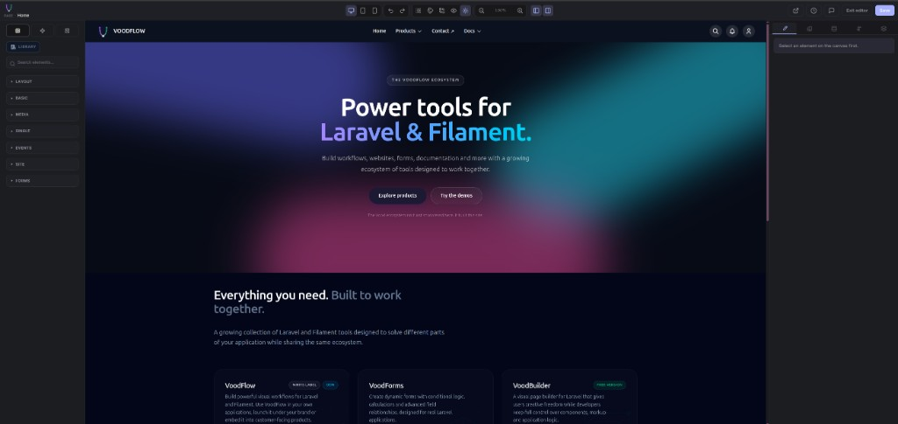
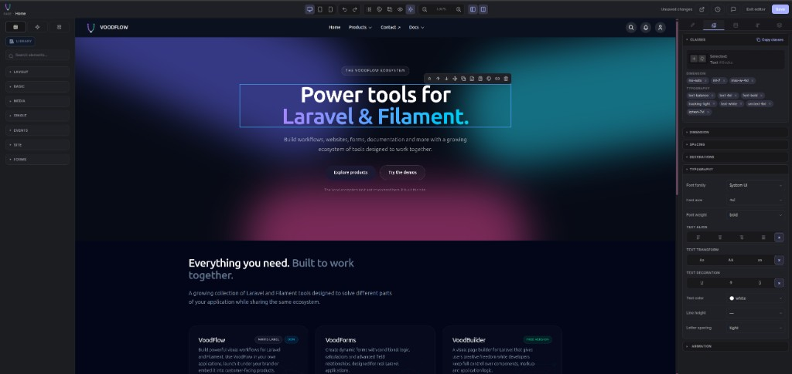
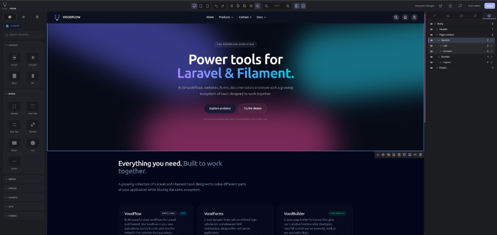

# VoodBuilder (`voodflow/voodbuilder`)

Visual **page builder** and public site shell for **Laravel + Filament 5** — themes, pages, navigation, and a GrapesJS editor with a usable **Community (free)** edition.



> **Docs & pricing:** [voodflow.com](https://voodflow.com)  
> **License:** Community is free to use — see [LICENSE](LICENSE). Paid add-ons are separate products on [voodflow.com](https://voodflow.com).

---

## Features

| Capability | What you get |
|------------|----------------|
| **Visual editor** | Drag-and-drop canvas, device previews, undo / redo, revision history, autosave, style inspector |
| **Community core** | Layout · Basic · Media · Single · Site blocks, plus local marketing sections (hero, features, CTA, FAQ, …) |
| **Theme Studio** | Map colours / sub-themes to Site pages and content channels |
| **Page access** | Public, registered-only, profile-based gates, optional password unlock |
| **Menu-driven URLs** | Pages get public routes from Navigation (e.g. `/about` or `/company/about`) |
| **Media** | Works with [`voodflow/vmedia`](https://github.com/voodflow/vmedia) (Composer dependency; register the Filament plugin when you want the admin UI) |
| **Chrome layouts** | Shared header / footer shells per channel, editable in the same builder |





Optional packages (cookie bar, Elements, Dynamic Data, Templates, Components, Popups, content verticals) extend the same editor. Details: **[voodflow.com](https://voodflow.com)**.

---

## Requirements

- PHP **8.4+**
- Laravel **12+** / **13+**
- Filament **5+**
- Vite + Tailwind CSS **v4** (theme CSS compiles in **your** app)
- [`voodflow/vmedia`](https://github.com/voodflow/vmedia) (pulled in by Composer)

Optional: [laravel/fortify](https://laravel.com/docs/fortify) for public login / `/account`.

---

## Installation

```bash
composer require voodflow/voodbuilder
php artisan voodbuilder:install --with-npm-build
```

`voodbuilder:install` publishes config, runs migrations, seeds demo data when allowed, patches Vite / `package.json`, and can compile assets.

Then register plugins on your Filament panel (only VoodBuilder is required — the others if you installed those packages):

```php
->plugins([
    \Voodflow\Voodbuilder\VoodbuilderPlugin::make(),
    \Voodflow\Vmedia\VmediaPlugin::make(), // optional media admin
    \Voodflow\Vcookiebar\VcookiebarPlugin::make(), // optional cookie bar
    // \Voodflow\Vpopups\VpopupsPlugin::make(), // optional popups
    // \Voodflow\Vforms\VformsPlugin::make(), // optional forms
])
```

If you skipped the build step: `npm run build` (or `npm run dev`).

> Stock Laravel `GET /` in `routes/web.php` overrides the VoodBuilder home route — the install command removes it.  
> Do **not** publish duplicate package migrations.

Flags: `--skip-npm`, `--skip-seed`, `--skip-migrate`, `--force`.

If Composer reports a Guzzle conflict on a fresh Laravel app:

```bash
composer require voodflow/voodbuilder -W
```

---

## Site pages & routing

1. **Admin → Site → Pages** — create a page and open the visual editor.  
2. **Admin → Site → Navigation** — link menu items to the page (or to a named route / URL).  
3. Public URLs come from config:

| Mode | Example |
|------|---------|
| Prefixed (default) | `/pages/about` |
| Menu paths (`menu_paths`) | `/about` or `/company/about` from the menu tree |

```php
'pages' => [
    'enabled' => true,
    'route_prefix' => 'pages',   // '' + menu_paths → clean URLs from Navigation
    'menu_paths' => false,
],
```

Reserved first segments (`admin`, `vmedia`, `voodbuilder`, `login`, …) never become page sections, so package APIs are not shadowed.

### Page access

Per page you can combine:

- **Visibility** — public / registered users / profile-based gates  
- **Password** — unlock form; session TTL configurable (`password_unlock_minutes`)

---

## Theme Studio

**Admin → Themes** maps sub-themes (palettes + optional CSS) to areas:

- Site pages  
- Content channels (docs, tutorials, events, …) when those packages register channels  

Light / dark is a global preference on top of the area theme.

---

## Editor

- Block library with layout, media, and marketing sections  
- Style inspector (Tailwind-aware)  
- Device previews (desktop / tablet / mobile)  
- Undo / redo and page revisions  
- Media picker via vmedia  

---

## Documentation

| Where | What |
|-------|------|
| **[voodflow.com](https://voodflow.com)** | Guides, pricing, demos |
| Package `CHANGELOG.md` | Release notes |
| [SECURITY.md](SECURITY.md) | Vulnerability reporting |

---

## Licence & support

- Community core: free to use — see [LICENSE](LICENSE)  
- Paid add-ons: [voodflow.com](https://voodflow.com)  
- Security: [SECURITY.md](SECURITY.md) (not via public issues)
