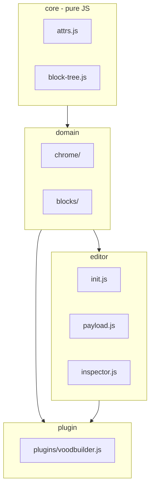

# VoodBuilder Editor — Piano refactor modulare

**Branch:** `modular`  
**Package:** `app/packages/voodflow/voodbuilder`  
**Stato:** implementazione fasi 0–6

---

## Executive summary (IT)

### Obiettivi

- Risolvere problemi strutturali del layer Editor: cicli di import, duplicazioni (`findPrimaryBlock`), inspector nav/footer inaffidabile.
- Introdurre architettura a 4 layer (`core` → `domain` → `editor` → `plugin`) con naming corto e coerente.
- Mantenere **invariati** look & feel, funzionalità e contratto PHP `EditorConfigurableBlock`.
- **Zero patch** a `node_modules/grapesjs`.

### Definition of Done

- [x] Inspector nav/footer in layout editor: tab Content, form custom
- [x] Page editor: chrome non selezionabile, nessuna settings nav/footer
- [x] Zero cicli import plugin ↔ canvas-drag ↔ chrome-layout
- [x] `plugins/voodbuilder.js` < 400 righe (orchestrazione)
- [x] `editor/init.js` bootstrap snello; `editor.js` shim re-export
- [x] Un solo `findPrimaryBlock` in `core/block-tree.js`
- [x] `docs/MODULAR_REFACTOR_PLAN.md` pubblicato
- [x] Build Vite OK

### Rollback

Branch `tests` come baseline funzionale pre-refactor.

---

## Architettura target



### File tree

```
resources/js/editor/
├── core/
│   ├── attrs.js
│   └── block-tree.js
├── chrome/
│   ├── ids.js
│   ├── slots.js
│   ├── zones.js
│   ├── layout/  (boot, canvas, drag, export)
│   ├── page/    (boot, locks, export)
│   └── blocks/
│       ├── nav/   (root, preview, config, settings)
│       └── footer/ (root, preview, config, settings)
├── blocks/
│   ├── dynamic/ (type, refresh, guards)
│   └── settings/ (select, registry, ui, index)
├── editor/
│   ├── init.js
│   ├── payload.js
│   ├── inspector.js
│   └── modes/ (layout, page, popup)
├── plugins/
│   └── voodbuilder.js
└── _legacy/ (shim temporanei, rimossi fase 6)
```

---

## Naming convention

| Prefisso | Significato | Esempio |
|----------|-------------|---------|
| `is*` | query booleana | `isNavBlock` |
| `find*` | trova componente | `findBlockRoot`, `findInspectableRoot` |
| `findZone*` | drop zone | `findZone` |
| `findSlot*` | content slot | `findSlot(editor, 'page')` |
| `ensure*` | crea se manca | `ensureZones` |
| `lock*` | preview read-only | `lockNavPreview` |
| `apply*` | sync preview | `applyNavPreview` |
| `register*` | side-effect GJS | `registerLayoutMode` |
| `extract*` | export HTML | `extractLayoutHtml` |

**Vietato:** duplicare `findPrimaryBlockInModelTree`, `isSiteNavBlock` sparsi, import `plugins/` da `chrome/`.

---

## Appendice A — Function catalog (EN)

| New | File | Replaces |
|-----|------|----------|
| `readBlockId` | `core/block-tree.js` | duplicates in selection + chrome-content-slot-utils |
| `findBlockRoot` | `core/block-tree.js` | `findBlockRoot` in selection |
| `findPrimaryBlock` | `core/block-tree.js` | `findPrimaryBlockInModelTree`, `findPrimaryBlockInContainer`, `findPrimaryBlockInChromeDropZone` |
| `isNavBlock` | `chrome/ids.js` | `isSiteNavBlock`, `isSiteHeaderBlock` |
| `isFooterBlock` | `chrome/ids.js` | `isSiteFooterBlock` |
| `findSlot` | `chrome/slots.js` | `findContentSlot`, `findPageContentSlotInEditor` |
| `findZone` | `chrome/zones.js` | `findDropZone` |
| `findInspectableRoot` | `blocks/settings/select.js` | `resolveInspectableBlockRoot` |
| `resolveSettings` | `blocks/settings/registry.js` | `resolveBlockSettingsTarget` |
| `initEditor` | `editor/init.js` | `initVpressEditor` |
| `buildPayload` | `editor/payload.js` | inline in editor.js |
| `wireInspector` | `editor/inspector.js` | `registerInspectorExtensions` |

### Block settings flow

1. `component:selected` → `findInspectableRoot` (model tree, no DOM)
2. `resolveSettings` → descriptor + root
3. `layoutOnly: true` on nav/footer → page shell skips custom form
4. Layout mode → `__voodbuilderActivateInspectorTab('content')`

---

## Appendice B — Import rules

| Layer | May import | Must NOT import |
|-------|------------|-----------------|
| `core/*` | nothing | grapesjs, editor, plugin, chrome |
| `chrome/*` | `core`, other `chrome/*`, `blocks/settings` | `plugins/*` |
| `blocks/*` | `core`, `chrome/ids` | `plugins/*` |
| `editor/*` | domain + canvas + inspector | — |
| `plugins/voodbuilder.js` | `blocks/dynamic/type`, `chrome/blocks/*/settings` | `editor-chrome-layout` |

**Cycle break:** `canvas/drag.js` → `chrome/layout/drag.js` (not `editor-chrome-layout` → `plugin`).

---

## Shim policy

- Legacy paths (`block-settings/`, `editor-chrome-layout.js`, `voodbuilder-editor.js`) re-export new modules for one internal release.
- Checklist rimozione: grep zero imports to legacy path → delete shim.

---

## Test plan

### Smoke manuale

**Layout editor**

1. Apri chrome layout editor
2. Click blocco nav → tab Content mostra "Navbar settings"
3. Click blocco footer → tab Content mostra "Footer settings"
4. Salva → ricarica → zone NAV/CONTENT/FOOTER intatte

**Page editor**

1. Apri page editor con shell
2. Click header/footer → deselezione / nessun form nav-footer
3. Click area content → editing normale
4. Layer: lock su chrome, edit su content

### Automatici

- Vitest: `core/block-tree`, `blocks/settings/select` (drop zone senza DOM)
- PHPUnit esistente: `ChromeLayoutHtmlSanitizer`, export sanitizer

---

## Fasi implementate

| Fase | Scope | PR size |
|------|-------|---------|
| 0 | Questo documento + link in JS_MODULAR_ARCHITECTURE | doc |
| 1 | `core/attrs`, `core/block-tree`, shim legacy | ~200 righe |
| 2 | `chrome/ids`, preview lock, break import cycle | ~400 righe |
| 3 | `blocks/settings`, nav/footer settings, `layoutOnly` | ~600 righe |
| 4 | `blocks/dynamic`, `editor/init|payload|inspector`, slim plugin | ~800 righe |
| 5 | `chrome/layout/*`, `chrome/page/*`, `findSlot` unify | ~600 righe |
| 6 | Cleanup shims, Vite entry, audit doc, build | ~200 righe |

---

## Cosa NON si tocca

- CSS `resources/css/editor/`
- `bindings-ui.js`, `components-ui.js` (fase 7+)
- API PHP save/render (solo regression test)
