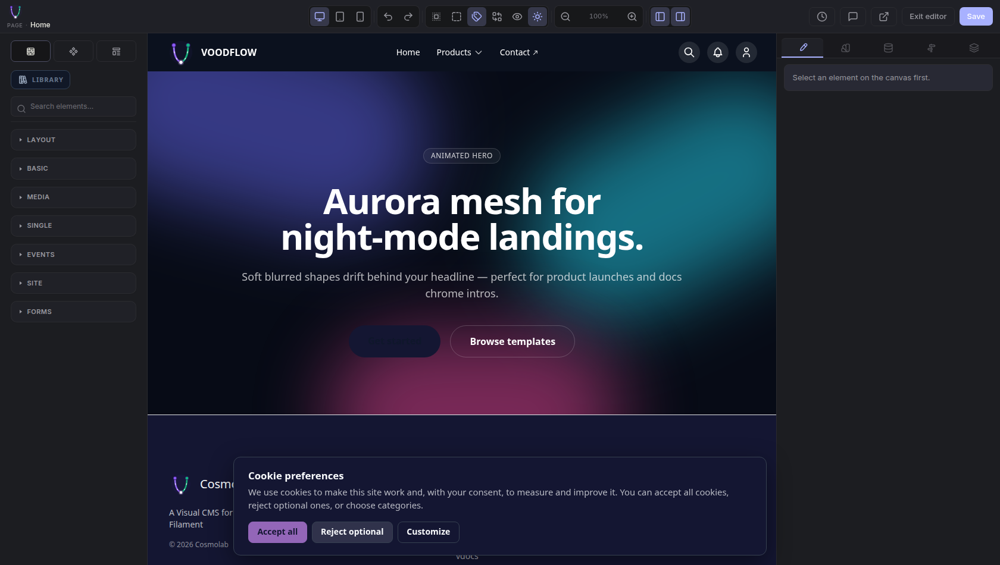

# Analisi VoodBuilder — velocità, UI/UX, sicurezza, espansioni, companion

**Data:** 1 settembre 2026
**Versione pacchetto:** `voodflow/voodbuilder` 0.0.11 (branch `refactor/modular-architecture`)
**Ambiente di misura:** Docker `cosmolab-*`, PHP 8.4, Laravel 13, Filament 5, GrapesJS
**URL analizzato:** `http://localhost:8010/?locale=en&edit=1` (editor pagina, chrome shell mode)
**Metodo:** Chrome headless autenticato come `admin@cosmolab.test`, CDP Profiler + Performance metrics, misure ripetute

> Nota sulla lettura dei numeri: la macchina di misura era a load average ~16 costante.
> I valori di fps assoluti non sono affidabili e non li uso come metrica. Uso invece
> metriche indipendenti dal carico: durata di script/layout dal CDP, byte trasferiti,
> conteggi DOM, e il profilo CPU campionato.

---

## Sintesi — se leggi solo questa pagina

Il blocco dell'editor è risolto (§0): era un loop di eventi tra la manutenzione degli spacer di drop
e l'handler `component:remove`. Il main thread in idle è passato da ~100% a 7,4% di CPU.

Da qui, le cinque cose che darei per prime, in quest'ordine:

1. **`PageBuilderAccess` su tutto `voodbuilder/editor/*`** (§3.3). Oggi qualsiasi utente registrato
   può far girare Node 60 secondi a richiesta e caricare file sul disco pubblico. Mezz'ora di lavoro.
2. **`EntitlementGate` su components import/export** (§3.4). La licenza è controllata solo nella UI,
   la route si chiama direttamente. Dieci minuti.
3. **Allowlist HTML vera, al save e al render** (§3.1). Oggi il sanitizer XSS gira in un solo punto
   della codebase e il render pubblico si fida del database. Mezza giornata, ma è il rischio più
   serio.
4. **Code splitting dell'editor** (§1.4). 663 KB gzip in un chunk unico, con dentro Jodit che non
   dovrebbe esserci e il CSS di GrapesJS duplicato. Boot da 9,5 secondi.
5. **Manifest companion + SDK JS pubblico** (§4.1, §4.2). Finché la discovery dei plugin è una lista
   scritta a mano nel core e i companion importano `../../../../voodbuilder/...`, non si possono
   vendere estensioni a terzi.

I punti 1, 2 e 5 hanno impatto diretto sul modello di business; il 3 è debito di sicurezza; il 4 è
ciò che l'utente percepisce ogni volta che apre l'editor.

---

## 0. Punto di partenza: il blocco risolto oggi

Prima di qualsiasi considerazione di ottimizzazione va registrato cosa è stato corretto oggi,
perché definisce la baseline di tutte le misure successive.

`ensureBottomDropSpacer()` rimuoveva e riaccodava lo spacer di drop a ogni chiamata, anche
quando era già al posto giusto. La rimozione emetteva `component:remove`, il cui handler
rischedulava la sincronizzazione degli spacer al frame successivo, che rimuoveva e riaccodava
di nuovo. In parallelo `editor-chrome-shell.js` reagiva all'`append` schedulando un refresh
della shell, che richiamava a sua volta la manutenzione degli spacer.

| Metrica | Prima | Dopo |
|---|---|---|
| requestAnimationFrame effettivi | **0,3 /s** | normale |
| CPU nei due handler | **88%** | assente dal profilo |
| CPU main thread in idle (10 s) | ~100% | **7,4%** |
| `ScriptDuration` su 10 s di idle | continua | **0,00 s** |
| Nodi Layers | crescita illimitata | stabile (263) |
| Errori in console | 1 `TypeError` ricorrente | 0 |

Commit: `1b24c14` su `refactor/modular-architecture`.

**Lezione da portare in avanti:** il bug non era di logica di business, era di *contratto sugli
eventi*. Nessuna funzione che muta l'albero dei componenti dovrebbe essere non idempotente, e
nessun handler di `component:add`/`component:remove` dovrebbe poter rientrare in una funzione
che a sua volta muta l'albero. Questo è il rischio sistemico numero uno di questa codebase e
torna nella sezione 1.4.

---

## 1. Velocità

### 1.1 Cosa costa il boot dell'editor

Timeline misurata dal `commit` della navigazione fino a editor usabile:

| Tappa | Tempo |
|---|---|
| Navigazione committed (TTFB 1554 ms) | 1 678 ms |
| Shell dell'editor nel DOM | 2 091 ms |
| iframe canvas presente | 8 964 ms |
| Splash di boot rimosso | 9 410 ms |
| Libreria blocchi popolata | 9 433 ms |
| Pannello Layers popolato | **9 445 ms** |

**Circa 9,5 secondi dal click a editor usabile.** Il buco grosso è tra i 2,1 s e i 9 s: la shell
è già a schermo ma il canvas non c'è ancora. Questo è il tratto su cui concentrare il lavoro.

### 1.2 Peso trasferito

| Risorsa | Peso | Tempo |
|---|---|---|
| `init-*.js` (bundle editor, chunk unico) | **2 594 KB** | 117 ms |
| `theme-*.css` | 701 KB | 25 ms |
| Documento HTML | **412 KB** | — |
| `editor-*.css` | 301 KB | 38 ms |
| `GET /voodbuilder/editor/blocks` | 180 KB | **756 ms** |
| `vendor/vforms/form-runtime.js` | 157 KB | 139 ms |
| `GET /voodbuilder/editor/components` | 66 KB | **347 ms** |
| Font Inter (3 woff2) | 155 KB | fino a 1 297 ms |
| **Totale** | **~4,46 MB** su 28 richieste | — |

Sul filo compresso, che è quello che conta davvero in rete: il bundle editor è **663 KB gzip**
(510 KB brotli) e il percorso critico JS + CSS dell'editor è **~808 KB gzip**.

### 1.3 I 412 KB di HTML sono configurazione inline

Il `<script type="application/json" data-voodbuilder-editor-config>` pesa **352 KB** e viene
parsato in modo sincrono prima che l'editor possa partire. Composizione:

| Chiave | Byte |
|---|---|
| `initial` (HTML + CSS della pagina) | 124 206 |
| `canvasFrameStyle` | 77 503 |
| `labels` (stringhe i18n) | 35 341 |
| `chromeShellParts` | 25 990 |
| `themePaletteCss` | 20 560 |
| `chromeLayoutCss` | 13 563 |
| `fonts` | 13 509 |

Tre osservazioni operative:

1. `canvasFrameStyle` + `themePaletteCss` + `chromeLayoutCss` = **112 KB di CSS trasportati come
   stringhe JSON dentro l'HTML**, quindi non cacheabili, non compressi separatamente, e riparsati
   a ogni apertura dell'editor. Dovrebbero essere `<link>` a file versionati sul disco pubblico.
2. `labels` (35 KB) è l'intero dizionario i18n dell'editor spedito a ogni boot. Va servito come
   asset statico per locale (`/voodbuilder/editor/labels/en.json`), cacheabile per sempre con hash.
3. `initial` è legittimamente per-pagina, ma è l'unico dei sette che lo sia davvero.

**Guadagno stimato:** ~230 KB fuori dal percorso critico dell'HTML, e soprattutto parsing JSON
sincrono ridotto di due terzi.

### 1.4 Il bundle è un chunk unico da 2,5 MB

`init-*.js` contiene tutto: GrapesJS, l'editor immagini Jodit, CodeMirror, il catalogo icone
Tabler, il media browser, la sidebar dei template, le revisioni, i pannelli Tailwind. Sono tutte
funzionalità **su richiesta**: un autore che apre una pagina per cambiare un titolo paga il costo
di parse e compile di tutte.

Vite non ha alcun `manualChunks`: il code splitting attivo copre solo CodeMirror (569 KB in chunk
separato), il media browser, il JSON delle icone Tabler (2,15 MB, correttamente lazy) e i font.
Tutto il resto è nel monolite.

Il sorgente dell'editor è **175 moduli per 72 810 righe**. I moduli più grandi sono tutti caricati
staticamente al boot anche quando non servono:

| Modulo | Righe | Quando serve davvero |
|---|---:|---|
| `bindings-ui.js` | 3 422 | solo usando "Make dynamic" |
| `tailwind-visual-style.js` | 2 924 | sempre (core) |
| `style-tailwind-panel.js` | 2 517 | solo con l'inspector Style aperto |
| `components-ui.js` | 2 078 | solo nel tab Componenti |
| `editor-animated-blocks.js` | 1 773 | solo con blocchi animati in pagina |
| `page-templates-sidebar.js` | 978 | solo aprendo il tab Template |
| `jodit-image-editor.js` | 999 | solo al comando "Modifica immagine" |

Due difetti puntuali che valgono un intervento rapido:

- **Jodit finisce nel bundle di boot.** Il costruttore è dietro `import()`, ma
  `jodit-image-editor.js` è importato staticamente da `init.js` e
  `jodit-focus-point-plugin.js` importa `@jodit/image-editor` staticamente: il codice della
  libreria è quindi dentro `init-*.js`. Basta spostare `registerJoditImageEditor` dietro
  `import()` per recuperarlo.
- **Il CSS di GrapesJS è caricato due volte.** È importato sia da `init.js` sia da `editor.css`,
  quindi le regole `gjs-*` compaiono in entrambi i bundle. Stimati 20–40 KB gzip sprecati.
- `grapesjs-custom-code` è in `package.json` ma non è importato da nessun modulo: dipendenza morta.

### 1.5 Il costo strutturale: 81 000 nodi DOM e 10 713 listener

Metriche CDP a boot completato:

| Metrica | Valore |
|---|---|
| `Nodes` (documento + canvas) | **81 097** |
| `JSEventListeners` | **10 713** |
| Nodi del solo documento editor | 17 525 |
| Righe nel pannello Layers | 263 |
| `TaskDuration` cumulata al boot | 7,33 s |
| `ScriptDuration` cumulata al boot | 4,66 s |

10 713 listener con 263 righe di Layers significa che si sta allegando handler per nodo invece
di usare delegation. È la causa più probabile del tratto 2 s → 9 s del boot, ed è anche ciò che
rende costoso ogni `Layers.render()`.

**In idle, però, l'editor ora è fermo davvero:** su 10 secondi senza interazione, 0,00 s di
script, 0,03 s di layout, 0,03 s di style recalc, 7,4% di CPU wall-clock. Dopo la correzione di
oggi non c'è più lavoro di fondo. Il problema residuo è tutto concentrato nel boot.

### 1.6 Priorità performance

1. **Spostare i CSS dalla config inline a `<link>` versionati** — basso rischio, ~112 KB e un
   parsing JSON pesante in meno.
2. **Servire `labels` come asset statico per locale** — basso rischio, 35 KB in meno per boot.
3. **Code splitting dei sette moduli on-demand** — rischio medio, è il taglio più grosso sui 2,5 MB.
4. **Event delegation nel pannello Layers e nella libreria blocchi** — rischio medio-alto ma è
   l'unico modo di attaccare i 10 713 listener e il buco di 7 secondi nel boot.
5. **`GET /voodbuilder/editor/blocks` a 756 ms per 180 KB** — va indagato lato server: è render di
   preview HTML per ogni blocco. Cacheabile per (tema, locale, entitlements).

### 1.7 Regola di ingegneria da adottare

Il bug di oggi sarebbe stato impossibile con due regole:

- Ogni funzione `ensure*` che tocca l'albero dei componenti **deve** essere idempotente e deve
  avere un test che la chiami due volte di fila verificando che la seconda non produca eventi.
- Le mutazioni programmatiche dell'albero devono passare da un unico punto che alza un flag di
  rientranza, come ora fa `syncDropSpacers()`. Vale la pena estendere lo stesso schema a
  `ensureTopDropSpacer`, agli inner drop slot e al refresh della chrome shell.

---

## 2. UI / UX

### 2.1 Cosa funziona

- **Accessibilità dei controlli a icona: sorprendentemente buona.** Su 186 pulsanti, 74 sono
  solo-icona e **tutti e 74 hanno `title` o `aria-label`**. Mi aspettavo il contrario; è un punto
  di forza da mantenere con un test di regressione.
- Sono presenti 2 regioni `aria-live` e uno stato di salvataggio dedicato
  (`data-voodbuilder-editor-saved`), quindi il feedback delle operazioni asincrone è pensato.
- L'inspector ha una gerarchia chiara a 5 tab (content, style, dynamic, conditions, layers) e uno
  stato vuoto esplicito ("Select an element on the canvas first") invece di un pannello morto.
- 10 categorie di blocchi collassate di default: la libreria non travolge l'utente all'apertura.

### 2.2 Il problema più visibile: il runtime del sito invade il canvas



Il banner "Cookie preferences" viene renderizzato **dentro il canvas di authoring** e copre
stabilmente la zona del footer. L'autore non può lavorare sul footer senza combatterci.

Non è una svista isolata: nel codice esistono già `isEditorHostBleedComponent()` e
`isCookieSettingsCtaClone()` che tentano di rimuovere questi nodi a posteriori, e la funzione
`purgeLeakedChromeCtaButtons()` ripulisce i pulsanti CTA che sfuggono. Si sta rincorrendo il
sintomo. La soluzione strutturale è che il canvas dell'editor dichiari un contesto
(`data-voodbuilder-editor-canvas`) e che i runtime dei companion (vcookiebar in primis) si
auto-disabilitino quando lo rilevano, invece di essere ripuliti dopo il fatto dal core.

Questo tocca direttamente la sezione companion: **il core sta pulendo i danni dei plugin, che è
esattamente il contrario di come deve funzionare un sistema di estensioni vendute a terzi.**

### 2.3 Boot da 9,5 secondi senza progressione informativa

Lo splash mostra logo + nome + versione, ma non dice cosa sta succedendo né a che punto è. Su 9,5
secondi l'utente non ha modo di distinguere un caricamento lento da un blocco — che è esattamente
la confusione capitata oggi. Con le tappe già misurabili (shell, canvas, blocchi, layers) si può
mostrare una progressione reale a 4 step con costo di implementazione minimo.

C'è già un failsafe a 3 500 ms che forza lo sblocco dello splash e logga un warning: utile, ma
significa che nel caso normale lo splash sparisce **prima** che l'editor sia pronto (9,4 s), quindi
l'utente vede un editor apparentemente pronto ma ancora inerte per ~6 secondi. È peggio di uno
splash onesto più lungo.

### 2.4 42 campi su 73 senza label programmatica

Nell'inspector, 42 input su 73 non hanno né `<label for>`, né `aria-label`, né `placeholder`.
Chi usa screen reader o navigazione da tastiera non può capire cosa sta modificando. È il divario
più grande tra la cura messa nei pulsanti (2.1) e il resto dell'interfaccia.

### 2.5 Salvataggio manuale senza rete di sicurezza

Il salvataggio è un pulsante esplicito, senza autosave e senza recupero di bozza locale. Su un
editor dove una sessione di lavoro dura decine di minuti e dove — come oggi — l'applicazione può
bloccarsi, la perdita di lavoro è una questione di quando, non di se. Esiste già l'infrastruttura
di revisioni (`revisions-ui.js`, endpoint di restore): serve un autosave periodico su bozza che ne
riusi il meccanismo.

### 2.6 Il pulsante CTA che non si vede

Nello screenshot, accanto a "Browse templates" c'è un pulsante renderizzato ma con testo
invisibile. Nel sanitizer esiste `restoreEmptyCtaLabels()` che ripristina l'etichetta dei CTA
svuotati dall'editor a partire da `data-voodbuilder-cta-label`. Anche qui: esiste una riparazione
a valle di un problema che continua a verificarsi a monte. Vale la pena trovare la causa
(probabilmente la serializzazione RichText del contenuto del `<a>`) invece di ripararlo a ogni
render.

### 2.7 Priorità UI/UX

1. Contesto canvas dichiarato + opt-out dei runtime companion (risolve banner cookie e CTA fantasma).
2. Splash con progressione reale a 4 step, allineato al vero istante di "pronto".
3. Autosave su bozza riusando le revisioni.
4. Label programmatiche sui 42 input dell'inspector.
5. Trovare la causa dei CTA svuotati invece di ripararli nel sanitizer.

---

## 3. Sicurezza

La superficie HTTP dell'editor è nel complesso protetta: tutte le route stanno dietro `web` + `auth`
con rate limiting dedicato, il salvataggio pagine passa da `EditorGate::canEdit()` per singolo
record, il CSRF è attivo, il salvataggio usa array espliciti invece di `$request->all()` e la
compilazione CSS **non** è vulnerabile a command injection (l'HTML arriva a Node via stdin, gli
argomenti del processo sono fissi). I blocchi Pro sono filtrati lato server, quindi manomettere gli
`entitlements` nel payload JS non li sblocca.

Restano però quattro problemi che meritano attenzione, due dei quali seri.

### 3.1 Critico — il sanitizer HTML non è un sanitizer XSS

`EditorHtmlSanitizer` normalizza URL, ripara blocchi animati e pulisce attributi: non rimuove
`<script>` né gli handler inline. L'unico punto in cui script e handler vengono tolti è
`EditorCustomCodeSanitizer`, che lavora a **regex** e viene invocato in **un solo punto di tutta la
codebase**:

```1030:1030:packages/voodflow/voodbuilder/src/Support/Editor/EditorGate.php
        $html = EditorCustomCodeSanitizer::sanitize($html);
```

Il rendering pubblico non lo riapplica — `EditorRenderer` usa solo `EditorHtmlSanitizer` — e il
Blade emette il risultato con `{!! !!}`. Ne derivano due conseguenze. La prima: i bypass regex sono
plausibili (handler senza virgolette, `<svg/onload=…>`, `<iframe srcdoc>`, `data:` in `src`) e un
solo bypass al salvataggio diventa XSS stored permanente per tutti i visitatori. La seconda, più
insidiosa: qualsiasi HTML entrato nel database per una strada diversa dal save dell'editor — seeder,
import di template, migrazione da versioni precedenti al sanitizer, scrittura diretta — viene
servito **senza alcun filtro**.

La correzione strutturale è adottare una allowlist vera (`symfony/html-sanitizer` o HTMLPurifier)
e applicarla **sia al salvataggio sia al rendering**, così che il render non si fidi mai di ciò che
c'è nel database. Una CSP `script-src` sul sito pubblico è la rete di sicurezza finale.

### 3.2 Critico — il runtime dei popup esegue JS arbitrario sui visitatori

```310:310:packages/voodflow/vpopups/resources/js/popups-runtime.js
            const runner = new Function(popup.js);
```

L'HTML del popup viene iniettato con `innerHTML` e il JS eseguito con `new Function`, su ogni
visitatore del sito. La funzione `sanitizePopupHtml` lato client fa un round-trip attraverso
`DOMParser` e restituisce `body.innerHTML`: non rimuove nulla. Lato server
`EditorPopupHtmlNormalizer` pulisce container vuoti, non script. `EditorJsSanitizer` blocca `fetch`
ed `eval` ma lascia passare tutto il resto del DOM API, quindi non è una barriera.

Chi gestisce i popup ha di fatto esecuzione di codice nel browser di ogni visitatore. Se è una
scelta di prodotto va documentata come tale e ristretta a un ruolo esplicito; altrimenti il JS dei
popup va sostituito con hook dichiarativi e l'HTML sanitizzato server-side con la stessa allowlist
delle pagine.

### 3.3 Alto — gli endpoint dell'editor chiedono solo di essere loggati

`EditorCompileCssController` non ha alcun controllo di autorizzazione oltre al middleware `auth`:
entra direttamente nella validazione. Stessa cosa per `EditorCodeHighlightController`,
per l'upload media di fallback del core (`EditorAssetController`) e per le route di
`voodbuilder-elements`.

Significa che un utente registrato qualsiasi — l'iscritto alla newsletter, il cliente con account
sul sito — può far girare Node per 60 secondi a richiesta fino a 180 volte al minuto, caricare file
sul disco pubblico e sfogliare il catalogo Elements. Il rimedio è a bassissimo costo: la stessa
`abort_unless(PageBuilderAccess::userCanUsePageBuilder(), 403)` già usata da `EditorBlocksController`,
applicata come middleware su tutto il prefisso `voodbuilder/editor/*`.

Collegato: l'upload del core accetta SVG e lo mette su disco pubblico senza le protezioni che
`vmedia` ha (`UploadGuard`, allow-list MIME, check di path traversal). Un SVG può contenere script.

### 3.4 Alto — import/export componenti non verifica la licenza

`GrapesJsComponentsController::import()` controlla `PageBuilderAccess` e che il modulo sia attivo,
ma `authorizeComponents()` si limita a `ComponentsModule::isEnabled()`. Le capability
`components.import` e `components.export` — assenti dalla matrice Professional — sono usate solo per
accendere i pulsanti nella UI. Chiamando la route direttamente si aggirano. Il rimedio è
`EntitlementGate::authorize('components.import')` nei due metodi, come già fa l'install da catalogo
remoto dei template.

### 3.5 Rischi minori

`RemoteElementsCatalogClient` segue `content_url` assoluti presenti nel catalogo senza la blocklist
di IP interni che `EditorPageTemplateRemoteImporter` invece applica: se il catalogo remoto venisse
compromesso diventerebbe una SSRF verso i metadata endpoint cloud. La preview Elements interpola
HTML remoto raw in una pagina servita a utenti editor. `importFromUrl` dei template non passa da
`EntitlementGate` mentre `catalog()` e `installCatalogEntry()` sì — probabilmente una svista di
licensing. L'endpoint analytics dei popup è scrivibile pubblicamente (throttle 120/min): spam sulla
tabella, niente di più.

### 3.6 Ordine di intervento

1. `PageBuilderAccess` su tutto `voodbuilder/editor/*` — mezz'ora di lavoro, chiude 3.3 per intero.
2. `EntitlementGate` su components import/export — dieci minuti, chiude una falla di ricavo.
3. Allowlist HTML unificata al save **e** al render — è il lavoro vero, mezza giornata.
4. Decisione di prodotto sul JS dei popup, poi implementazione conseguente.
5. Policy SVG sull'upload core; hardening SSRF sul client Elements.
6. CSP sul sito pubblico.

---

## 4. Espansioni future

L'architettura **PHP è matura**. La facade `Voodbuilder` espone una ventina di punti di
registrazione documentati, il contratto `VoodBuilderModule` con `ModuleRegistry` gestisce dipendenze
e boot ordinato, `AbstractDynamicPageProvider` permette di far evolvere i contratti senza rompere
chi li implementa, e i soft gate (`class_exists` + try/catch nei bridge) fanno sì che il core non
esploda mai in assenza di un companion. Un companion PHP first-party si scrive oggi in un solo
ServiceProvider, come dimostra `vevents`.

Il problema è tutto sul **lato JavaScript e sulla discovery**, e diventa bloccante nel momento in
cui si vogliono vendere estensioni a sviluppatori terzi.

### 4.1 La discovery dei plugin JS è una lista scritta a mano nel core

`plugin-bridge.js` scopre i companion con `import.meta.glob` su un elenco fisso di otto percorsi
sibling. Aggiungere un companion ufficiale richiede quindi di **modificare il core**; un autore
esterno non ha modo di farsi caricare se non forkando o agganciandosi a `window.VoodbuilderEditor`
prima del boot. Quattro dei percorsi in lista (`voodbuilder-components`, `-dynamic-data`,
`-templates`, `-fonts`) puntano a `plugin.js` che non esistono: glob vuoti silenziosi.

La soluzione è un **manifest dichiarativo** nel `composer.json` di ogni companion, con uno scanner
al boot lato PHP e un plugin Vite che ne legge l'output:

```json
"extra": {
  "voodbuilder": {
    "js": "resources/js/editor/plugin.js",
    "module": "AcmeModule",
    "capabilities": ["acme.blocks"]
  }
}
```

### 4.2 I companion importano path interni del core

```5:5:packages/voodflow/vexhibitors/resources/js/editor/plugin.js
import { registerBlockSettings, runWithSettingsChangeGuard } from '../../../../voodbuilder/resources/js/editor/blocks/settings/index.js';
```

Quattro livelli di `../` funzionano solo nel monorepo con path-repo. Con un'installazione Composer
normale in `vendor/` questo import si rompe. Serve un **entry point stabile** — un
`@voodbuilder/editor-sdk` npm, o quantomeno un alias Vite ufficiale — che riesporti
`registerBlockSettings`, `editor-form-ui` e `voodbuilder-dynamic-config` come API pubblica.

### 4.3 Il core conosce i companion per nome

Circa quindici file in `voodbuilder/src/` citano companion specifici: `LogicalRouteName` ha una
regex su `vevents.{locale}.*`, `EditorHtmlSanitizer` preserva `data-vforms-visibility`,
`EditorCanvas` legge il CSS dei popup da un path filesystem sibling, `init.js` ha `vevents`
hardcoded nel context. Ognuno di questi è un punto in cui un companion terzo non può inserirsi.
Vanno convertiti in hook registrabili: provider di normalizzazione route, lista di attributi da
preservare, URL da module config invece che path su disco.

### 4.4 La UI commerciale vive ancora nel core

`init.js` importa staticamente `components-ui.js` e `bindings-ui.js`, cioè l'interfaccia di due
pacchetti venduti separatamente. La roadmap è già scritta in `EDITOR_JS_PLUGINS.md`; completarla ha
un doppio ritorno, perché è anche il prerequisito per il code splitting del §1.4. Il modello da
replicare è `popups-ui.js`, che nel core è solo uno shim che delega.

### 4.5 Sequenza consigliata

Il primo blocco (manifest + SDK JS + fine estrazione UI) è ciò che rende l'ecosistema realmente
apribile a terzi, e conviene farlo prima di avere companion esterni da non rompere. Il secondo
blocco riguarda i confini commerciali: capability per companion (`companion.vevents`), rimozione dei
nomi dal core, e un documento che dichiari cosa è API pubblica (`Voodbuilder`, `Contracts/*`, export
del bridge) e cosa è interno (`Support/Editor/*`). Il terzo è go-to-market: pubblicazione su
Packagist, repo scaffold con test di soft-gate, e una policy semver con changelog dei breaking
change sul markup dei blocchi e sulle chiavi del payload `EditorGate`.

---

## 5. Gestione attuale dei companion

### 5.1 Come funziona oggi

Il gating commerciale è a **due chiavi** e il pattern è corretto: installare il pacchetto Composer
non basta, bisogna anche registrare il plugin Filament sul panel. Sopra c'è il layer entitlements
(`EntitlementProviderFactory`, driver `config` / `anystack` / `testing`, con grace period di 7
giorni sul remoto) e la `EditionCapabilityMatrix` community/pro/agency. I companion interrogano
`Voodbuilder::can('capability')` invece di controllare la stringa di edizione — che è la scelta
giusta, perché disaccoppia il codice dal listino.

L'enforcement server-side è però **disomogeneo**: blocchi Pro, template e dynamic data sono filtrati
lato server, i componenti no (§3.4).

### 5.2 Duplicazione tra companion

Quattro pacchetti dell'ecosistema eventi condividono codice praticamente identico.
`VpartnersEditorBlockConfigs`, `VsponsorsEditorBlockConfigs`, `VexhibitorsEditorBlockConfigs` e
`VeventsEditorBlockConfigs` hanno lo stesso schema `defaults` / `requires_event_id`. Lo snippet di
`registerChannelStylesheet` è ripetuto in quattro ServiceProvider. I plugin JS di `vevents` e
`vexhibitors` hanno la stessa struttura (set di block ID, gestione `NEEDS_EVENT_ID`, UI del form).

In più il plugin di `vevents` gestisce anche i blocchi di `vpartners` e `vsponsors`: un accoppiamento
che rende impossibile vendere quei due pacchetti separatamente. Un paio di trait condivisi
(`ChannelStylesheetRegistration`, `EditorBlockConfigDefaults`) e la separazione dei plugin JS per
dominio risolvono entrambe le cose.

### 5.3 Il caso vforms

`vforms` non usa il bridge standard: pubblica il suo JS in `public/vendor/vforms/editor-plugin.js` e
si auto-registra su `window.VoodbuilderEditor`. Non compare in `plugin-bridge.js`. È un terzo
meccanismo di integrazione oltre ai due ufficiali, e va o allineato al manifest del §4.1 o
documentato esplicitamente come pattern alternativo supportato.

### 5.4 Versioning

I companion dichiarano `voodflow/voodbuilder: >=0.0.11`, che in pratica significa "qualsiasi
versione futura". Senza una policy semver e senza la distinzione dichiarata tra API pubblica e
interna, ogni refactor del core è un breaking change potenziale non segnalato. Con companion
first-party lo si assorbe con i test; con companion venduti a terzi diventa un problema di
supporto.

### 5.5 Nota sul monorepo

Il `composer.json` del core ha in `autoload-dev` i PSR-4 di vpopups, vforms, components e
dynamic-data **dentro il namespace del core**. È un artefatto della test suite del monorepo, non un
problema di runtime, ma confonde il confine tra pacchetti per chi legge il codice da fuori. Vale la
pena separarlo prima di aprire il repo o pubblicare l'SDK.
